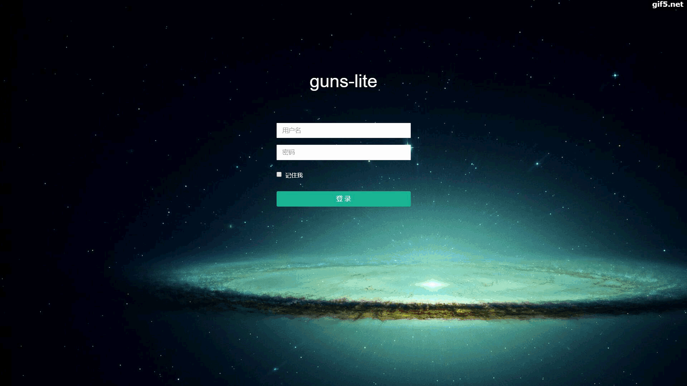

# 前言

本文档以向导的方式引导用户使用guns-lite系统做二次开发，
guns-lite项目本身有readme文件，如果你有使用spring boot的和beetl的经验，那么基本上你是用不上本文档了，
有什么问题直接看代码即可。大多数功能都可以参考代码，即使找不到的google和百度也能帮到你。

但是考虑到有的开发者可能初次使用上述组件，有的甚至刚接触java不久，那么本文当将引导你一步步使用本系统搭建一个后台管理系统，并做二次开发。

## 演示
- http://guns-lite.enilu.cn/

## 版本说明

 - guns-lite是在[guns](https://github.com/stylefeng/Guns)的基础上将数据库层由mybatis替换为spring data jpa的系统。
 - guns-lite是一个基于spring boot的后台管理系统。

## 分支
- admin-flat 该分支将页面更改为扁平化风格，去掉iframe+标签页的形式:

 

- oracle, 该分支将底层数据使用oracle。

## 目录说明
- guns-admin 一个成熟的后台管理系统，完全具备了后台管理系统的基本功能
- guns-utils 工具包
- guns-dao  dao层
- guns-entity 实体层
- guns-service 服务层

## 技术选型

- 核心框架：spring boot
- 数据库层：spring data jpa
- 安全框架：Shiro
- 数据库连接池：Druid
- 缓存：Ehcache

## 包含的功能
guns-lite包含了成熟的后台管理功能guns-admin，以及前后端分离的的后端管理系统(guns-admin-vuejs和guns-api)
上面两者包含的功能一致：
- 部门管理
- 用户管理
- 角色管理
- 菜单管理：配置菜单功能
- 权限分配：为指定的角色配置特定的功能菜单
- 参数管理：维护系统参数，并缓存系统参数提供高效的读取
- 数据字典管理：配置维护数据字典
- 定时任务管理：编写、配置、执行定时任务
- 业务日志：通过注解的方式记录用户操作日志，并提供日志查询功能
- 登录日志：查看用户登录登出日志

**后续考虑添加的功能**
- 消息管理：配置并发送消息的功能，短信类型可以包括：短信，邮件，微信模版消息，钉钉提醒等。

## 使用

- 克隆本项目
- 导入idea或者eclipse，确保开发工具安装了lombok插件，如果不了解该插件，请自行google
- 创建数据库：guns-lite，更改相应数据库配置
- guns-dmin启动的时候回自动创建表并导入src/main/resources/import.sql到数据库中，所以无需开发人员自己初始化表结构
- 启动guns-admin
- 访问 https://localhost:8080，   登录，用户名密码:admin/admin 
## 文档

- [http://enilu.github.io/guns-lite](http://enilu.github.io/guns-lite)
- [http://enilu.gitee.io/guns-lite](http://enilu.gitee.io/guns-lite)

## 感谢

- [stylefeng](https://github.com/stylefeng) 没有他就没有guns，没有guns就没有这个guns-lite

## 交流
- Bugs: [Issues](https://github.com/enilu/guns-lite/issues/new)
- QQ: 欢迎加入qq交流群 740230743
- Gitter: [Gitter channel](https://gitter.im/guns-lite/community)

也欢迎你在github给该项目点个赞：[https://github.com/enilu/guns-lite](https://github.com/enilu/guns-lite)

另提供了他的前后端分离版（vuejs)：[http://enilu.gitee.io/web-flash](http://enilu.gitee.io/web-flash)
