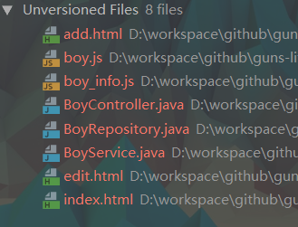
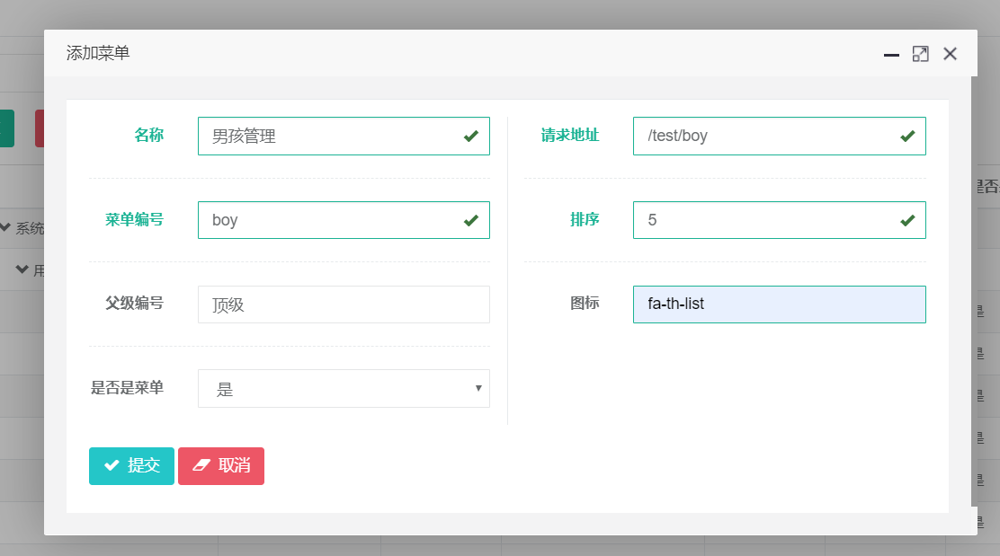
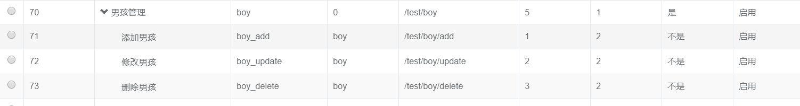

# guns-lite代码生成工具
# 代码生成

## 用法
- 在guns-entity/pom.xml中添加依赖
```xml
<dependency>
    <groupId>cn.enilu</groupId>
    <artifactId>guns-generator</artifactId>
    <version>${project.version}</version>
</dependency>
```
- 下载intellij代码生成插件，在插件中心搜索并安装插件:webflash-generator

- 写好实体类，例如：
```java
package cn.enilu.guns.bean.entity.test;
import cn.enilu.guns.bean.entity.BaseEntity;
import lombok.Data;
import org.hibernate.annotations.Table;

import javax.persistence.Column;
import javax.persistence.Entity;
 
@Entity(name="t_test_boy")
@Table(appliesTo = "t_test_boy",comment = "男孩")
@Data
public class Boy extends BaseEntity {
    @Column(columnDefinition = "VARCHAR(32) COMMENT '姓名'")
    private String name;
    @Column(columnDefinition = "INT COMMENT '年龄'")
    private Integer age;
    @Column(columnDefinition = "VARCHAR(12) COMMENT '生日'")
    private String birthday;
    @Column(name = "has_girl_friend",columnDefinition = "TINYINT COMMENT '是否有女朋友'")
    private Boolean hasGirFriend;
}
``` 
- 上面实体类注意事项
    - @Table注解要使用org.hibernate.annotations.Table 不要使用javax.persistence.Table
    - @Table注解 必须配置表名(applyiesTo)和注释(comment)
    - @Column注解必须配置columnDefinition来表述列信息(英文全部大写)：包括类型,注释COMMENT
    - 实体类必须继承BaseEntity
- 实体类准备好了后,打开实体类，右键点击“Generator"-->"web-flash-mvc"，弹出如下图所示对话框
    
**注意**不用更改对话框中的配置(大部分没有什么作用)
- 运行生成代码后，将会生成controller,service,repository，以及对应的增上改查页面和js,以Boy为例,生成的代码如下所示：

- 代码生成后，在系统中配置对应的菜单和权限，即可使用





