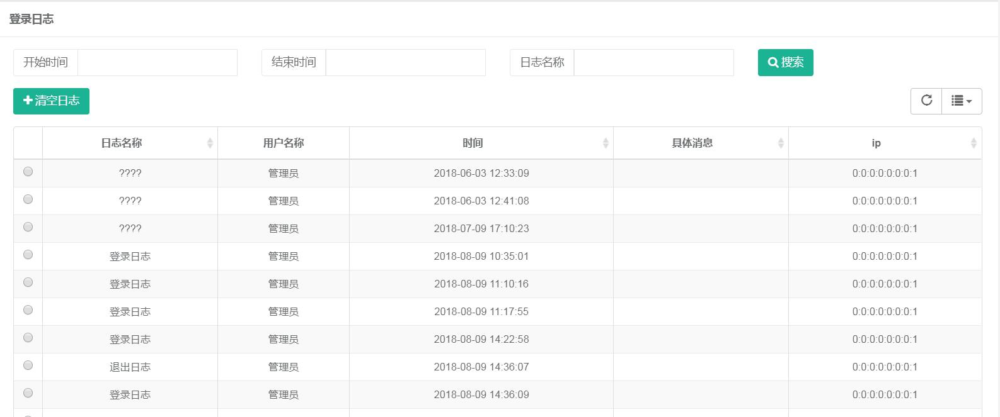

# 日志管理
日志管理包括两方面：
一个是后台用户登录日志的查看
一个是业务日志查看，业务日志内容主要包含两方面：系统产生的异常和用户操作日志。


## 登录日志
用户登录系统和退出系统的时候会调用LogTaskFactory记录相关日志，并在“登录日志”页面进行展示。



## 业务日志

业务日志包含异常日志和业务操作日志两大类日志收集、保存和展示。

### 异常日志

系统提供了异常处理类：GlobalExceptionHandler 来对系统各种异常进行统一收集保存。
该类提供了九个方法来分别对9中常见的异常类型进行收集保存，如果开发者自己有特殊需求需要对其他异常类型处理。，可以通过新增处理方式来对新的异常进行收集。


### 业务操作日志

系统提供了通过注解的形式可以方便的添加业务操作日志，比如在新增部门的是增加业务日志通过如下方式：

在DeptController的新增部门方法增加注解：

```java
    /**
     * 新增部门
     */
    @BussinessLog(value = "添加部门", key = "simplename", dict = DeptDict.class)
    @RequestMapping(value = "/add")
    @Permission
    @ResponseBody
    public Object add(Dept dept) {
        if (ToolUtil.isOneEmpty(dept, dept.getSimplename())) {
            throw new GunsException(BizExceptionEnum.REQUEST_NULL);
        }
        //完善pids,根据pid拿到pid的pids
        deptSetPids(dept);
        return this.deptRepository.save(dept);
    }
```

具体的实现逻辑感兴趣的同学可以自行通过注解类：BusinessLog进行跟进查看。